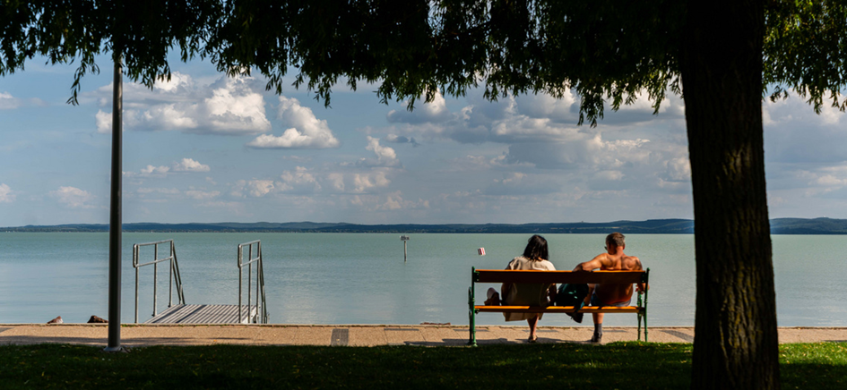

# Lake Balaton Bench Logger
*“Find the best benches to relax by the lake!”*

---

## Table of Content
TODO:

---

## Author
Made by Hanna Szalai (hs223xt)

## Project Overview  
Each summer, thousands of people circle Lake Balaton by bike or foot, seeking the perfect place to rest. But what makes a bench perfect? Is it the view, the temperature, the breeze, or the warm sun on your back?  
A small IoT device was placed under one of Balaton’s most iconic benches to find out. It senses when people sit, how warm and humid it is, and how much sun hits the bench. It even lets passersby select their score from 1-5 stars which adds to the total score. All the data flows into a colorful website, complete with real-time comfort ratings, weather alerts, and history graphs.  
Think of it as TripAdvisor for benches.

What problem does it solve?  
What data is collected, and how is it used?

---

## Estimated Time
TODO:
---

## Project Objective
TODO:

---

## Bill of Material
| Image | Component | Price (SEK) | Purpose |
|-------|-----------|-------------|---------|
|  | Raspberry Pi Pico WH | 99 SEK | Main microcontroller with WiFi |
|  | Breadboard | 69 SEK | Prototyping platform |
|  | USB cable | 49 SEK | Power and programming |
|  | Lab cable M/M, F/M | 49 SEK | Connections between components |
|  | Digital temperature and humidity sensor DHT11 | 49 SEK | Environmental sensing |
|  | TLV49645 SIP-3 Hall effect sensor digital | 12,5 SEK | Magnetic field detection |
|  | MCP9700 TO-92 Temperature sensor | 11,5 SEK | Temperature monitoring |
|  | Photoresistor CdS 4-7 kohm | 9 SEK | Light level detection |
|  | LEDs | 15 SEK | Status indicators |
|  | Carbon film resistors | 25 SEK | Current limiting |
|  | Magnet Neo35 Ø5mm x 5mm | 11 SEK | Hall sensor trigger |
|  | Tactile switch PCB 6x6x5mm black | 1,25 SEK | User input button |

---

## Raspberry Pi Pico W setup
TODO:

---

## Wiring
TODO: csinálni olyan képet

---

## Environmental Comfort Calculation  
Describe how environmental readings are interpreted.  
Include any calculations or logic used, for example:

- Real-feel calculation (temp + humidity)  + code snippets TODO:
- Rain detection pattern  
- Thresholds or categories used (e.g., Cold, Pleasant, Hot)

---

## Transmitting Data
Explain how data moves through the system:

- How often data is collected (e.g., every 3 seconds)  
- Where it is stored (e.g., database, server)  
- What triggers data transmission  
- Optional automation (e.g., push notifications)

---

## Data Storage and Visualization  
### Storage  
- Platform used 

### Visualization  
- Tools/libraries used 
- Realtime or static?  
- Custom UI or platform-based visualization?

---

# The Code
TODO: make it neat, rakd be folderekbe

## Development Phases  
Outline the project in phases:

1. Phase 1 – Terminal output (basic testing)  
2. Phase 2 – Platform visualization (InfluxDB, Node-RED, etc.)  
3. Phase 3 – Custom website with graphs and live data

---

## 8. Useful Links  
- GitHub repo: `[link]`  
- Demo Youtube video: `[YouTube link]`  
- Data platform: `[InfluxDB or dashboard link]`  
