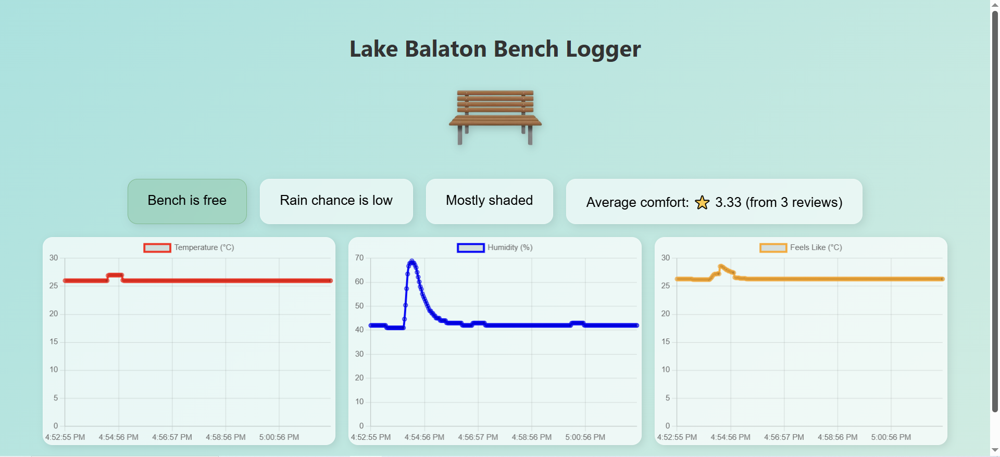

<div align="center">

</div>

## Table of Content
- [Author](#author)  
- [Project Overview](#project-overview)  
- [Estimated Time](#estimated-time)
- [Project Objective](#project-objective)  
- [Bill of Material](#bill-of-material)  
- [Raspberry Pi Pico W setup](#raspberry-pi-pico-w-setup)  
- [Wiring](#wiring)  
- [Calculations](#calculations)
- [Environmental Comfort Calculation](#environmental-comfort-calculation)  
- [Transmitting Data](#transmitting-data)  
- [Data Storage and Visualization](#data-storage-and-visualization)  
- [The Code](#the-code)  
- [Development Phases](#development-phases)  
- [Demo Video](#demo-video)

<div align="center">

</div>

## Author
Made by Hanna Szalai (hs223xt)

## Project Overview  
Each summer, thousands of people circle Lake Balaton by bike or foot, seeking the **perfect bench to relax on**. But what makes a bench perfect? Is it the view, the temperature, the breeze, or the warm sunshine on your shoulders?  
This small IoT project tries to figure that out.  
A device was placed under one of Balaton’s most iconic benches to monitor:
- when people sit down,
- how warm and humid it is,
- how bright the sun is,
- plus it lets people vote with a 1–5 star button.
All this data flows into a colorful online dashboard, showing:
- real-time comfort scores,
- weather alerts,
- and historical trends.  
Think of it as TripAdvisor for benches.

<div align="center">

</div>


## Estimated Time
<div align="center">

| Task | Time |
|------|------|
| Hardware prototyping | 1,5 hours |
| MicroPython firmware | 2 hours |
| Docker (TIG stack) setup | 3 hours |
| Frontend + dashboard tweaks | 2 hours |
| Testing & polishing | 1,5 hours |
| **Total:** | **~10 hours** |

</div>

## Project Objective
Build a low-power, WiFi-based device to monitor bench comfort and user ratings, save data in InfluxDB, and display it live on a custom Flask + Chart.js dashboard.

## Bill of Material
| Image | Component | Price (SEK) | Source | Purpose |
|-------|-----------|-------------|--------|---------|
|  | Raspberry Pi Pico WH | 99 SEK | Electrokit | Main microcontroller with WiFi |
|  | Breadboard | 69 SEK | Electrokit | Prototyping platform |
|  | USB cable | 49 SEK | Electrokit | Power and programming |
|  | Lab cable M/M, F/M | 49 SEK | Electrokit | Connections between components |
|  | Digital temperature and humidity sensor DHT11 | 49 SEK | Electrokit | Environmental sensing |
|  | TLV49645 SIP-3 Hall effect sensor digital | 12,5 SEK | Electrokit | Magnetic field detection |
|  | MCP9700 TO-92 Temperature sensor | 11,5 SEK | Electrokit | Temperature monitoring |
|  | Photoresistor CdS 4-7 kohm | 9 SEK | Electrokit | Light level detection |
|  | LEDs | 15 SEK | Electrokit | Status indicators |
|  | Carbon film resistors | 25 SEK | Electrokit | Current limiting |
|  | Magnet Neo35 Ø5mm x 5mm | 11 SEK | Electrokit | Hall sensor trigger |
|  | Tactile switch PCB 6x6x5mm black | 1,25 SEK | Electrokit | User input button |
| | **TOTAL** | **~400 SEK** | | |

## Raspberry Pi Pico W setup
- Plug it into your computer while pressing the reboot button, then copy the .UF2 file into the pico.  
  More information here: https://micropython.org/download/RPI_PICO_W/
- Download VS Code, follow the tutorial here: https://code.visualstudio.com/download
- Then install the Python extension:


- And install the MicroPico extension to run the pico files:


## Wiring
TODO: fritzing diagram


## Calculations

### ⚠ Disclaimer
This is an approximation. Do not rely solely on these calculations if you want to replicate this project.  
Always verify all connections, resistor values, and current ratings yourself to ensure safety and proper functioning.


| Component                        | Operating Voltage | Current (approx) | Resistor Needed | Remarks                           |
|-----------------------------------|-------------------|------------------|-----------------|-----------------------------------|
| Raspberry Pi Pico W               | 3.3V               | ~50 mA idle      | -               | Powers everything, connects via WiFi |
| DHT11 Temp+Humidity Sensor        | 3.3V               | ~2.5 mA          | -               | On `GP17` (Pin 22) |
| MCP9700 Analog Temp Sensor        | 3.3V               | <1 mA            | -               | On `ADC2` (GP28) |
| CdS Photoresistor (light sensor)  | 3.3V               | <1 mA            | Voltage divider | On `ADC0` (GP26) & `ADC1` (GP27) |
| Hall Effect Sensor                | 3.3V               | ~4 mA            | -               | On `GP16` (Pin 21), detects sitting |
| 3x Status LEDs (green/yellow/red) | 3.3V               | ~20 mA each      | ~220Ω each      | On `GP8`, `GP9`, `GP10` |
| 2x Bench LEDs                     | 3.3V               | ~20 mA each      | ~220Ω each      | On `GP6`, `GP7` |
| 5x Rating Buttons                 | -                  | - (pulled up)    | -               | On `GP11-15`, uses internal pull-up |
| WiFi Module (built-in)            | 3.3V               | ~50-120 mA active| -               | For MQTT/HTTP uploads |

**Total Estimated Current:**  
≈ 50 mA (Pico) + sensors + LEDs + WiFi peaks ≈ 150-180 mA max


### Environmental Comfort Calculation  
The device uses several calculations to interpret environmental readings in `main.py`:

#### 1. ADC to Voltage Conversion
```python
def read_voltage(adc):
    return adc.read_u16() * VREF / ADC_RES

# Constants:
VREF = 3.3        # ADC reference voltage
ADC_RES = 65535   # 16-bit ADC resolution
```

#### 2. MCP9700 Temperature Sensor Reading
```python
def read_mcp9700_temp():
    voltage = read_voltage(adc_mcp)
    return round((voltage - MCP9700_V0) / MCP9700_TCOEFF, 1)

# Constants:
MCP9700_V0 = 0.5      # 500mV at 0°C
MCP9700_TCOEFF = 0.01 # 10mV per °C
```

#### 3. Heat Index "Feels-Like" Calculation (Rothfusz Regression)
```python
def compute_heat_index(temp_c, humidity):
    # Convert to Fahrenheit
    T = temp_c * 9 / 5 + 32
    R = humidity

    # Heat index formula
    HI = -42.379 + 2.04901523*T + 10.14333127*R \
         - 0.22475541*T*R - 0.00683783*T*T \
         - 0.05481717*R*R + 0.00122874*T*T*R \
         + 0.00085282*T*R*R - 0.00000199*T*T*R*R

    # Convert back to Celsius
    return round((HI - 32) * 5 / 9, 1)
```

#### 4. Sun/Shade Detection
```python
sun_voltage = read_voltage(adc_sun)
shade_voltage = read_voltage(adc_shade)
sun_score = round(sun_voltage - shade_voltage, 2)

# Classification:
if sun_score < 0.2:
    status = "Mostly shaded"
elif sun_score < 0.6:
    status = "Partial sun"
else:
    status = "Full sun exposure"
```

#### 5. Rain Chance Estimation
```python
rain_chance = "Low"
if dht_hum > 90:
    if last_dht_temp is not None and dht_temp < last_dht_temp:
        rain_chance = "High"
    elif last_dht_temp is None:
        rain_chance = "Unknown"
```

#### 6. User Rating Average
```python
# When button pressed (1-5 stars):
total_reviews += 1
total_score += stars
avg_score = round(total_score / total_reviews, 2)
```

## Transmitting Data TODO: activity diagram
- The Raspberry Pi Pico W reads all sensors and user inputs, then transmits data **every 2 seconds** over WiFi (2.4 GHz) to a local InfluxDB server.
- It uses the built-in HTTP POST (via urequests), sending data in InfluxDB’s line protocol format like:

``` python
bench_data dht_temp=25.6,dht_hum=48,feels_like=26.9,rain=0,sun_score=0.3,sitting=1,avg_score=4.2,total_reviews=5
```
- Data is sent directly to the InfluxDB HTTP API running in Docker on the local network.
- From there, it’s queried by the Flask server and visualized live in the browser with Chart.js.
- LoRa or MQTT weren’t needed since the benches stay close to local WiFi, and I didn't have additional hardware to support anything besides WiFi.

## Data Storage and Visualization  
### Storage  
- Data is saved in InfluxDB on each send (every 2s) and kept for full history.
- Influx was chosen for time-series data, and the Pico automates everything by pushing readings in a loop.

### Visualization  
- The dashboard is a simple HTML + CSS page with Chart.js that updates every 2 seconds from Flask + InfluxDB.

## The Code

The project consists of three main components: MicroPython firmware for the Pico W, a Flask web server, and Docker services for data storage and visualization. (TIG)

#### `main.py` - Main Sensor Loop
The heart of the IoT device, running continuously on the Pico W:
- **Sensor Reading**: Polls DHT11, MCP9700, photoresistors, hall sensor, and buttons every 2 seconds
- **Data Processing**: Applies environmental calculations (heat index, sun/shade detection, rain estimation)
- **LED Control**: Updates status LEDs based on sensor readings and user interactions
- **Data Transmission**: Sends all collected data to InfluxDB via WiFi

Key features:
- Non-blocking button detection with debouncing
- Real-time comfort scoring based on multiple sensors
- Automatic WiFi reconnection handling
- Error handling for sensor failures

#### `wifiConnection.py` - WiFi Management
Handles network connectivity:
- Connects to specified WiFi network with credentials
- Returns assigned IP address for debugging
- Implements retry logic for connection failures
- Manages power-saving WiFi modes

#### `influxSender.py` - Data Transmission
Manages communication with the database:
- Formats sensor data into InfluxDB line protocol
- Sends HTTP POST requests to InfluxDB API
- Handles authentication with API tokens
- Provides error feedback for failed transmissions

### Flask Web Application

#### `server.py` - Backend Server
Python Flask server that bridges the database and frontend:
- **Data Retrieval**: Queries InfluxDB for latest sensor readings and historical data
- **API Endpoints**: Provides JSON data for the frontend to consume
- **Real-time Updates**: Serves fresh data every 2 seconds to match Pico transmission rate
- **Static File Serving**: Hosts the HTML dashboard and assets

#### `index.html` - Dashboard Frontend
Single-page application displaying real-time bench data:
- **Live Status Cards**: Shows current temperature, humidity, occupancy, and ratings
- **Interactive Charts**: Real-time graphs using Chart.js for trends over time
- **Responsive Design**: Works on desktop and mobile devices
- **Auto-refresh**: Updates every 2 seconds without page reload

#### `static/script.js` - Frontend Logic
JavaScript handling the dynamic behavior:
- Fetches data from Flask API endpoints
- Updates Chart.js graphs with new data points
- Manages real-time status card updates
- Handles error states and connection issues

#### `static/styles.css` - Dashboard Styling
Modern CSS styling for the dashboard:
- Clean, responsive layout using CSS Grid and Flexbox
- Color-coded status indicators for different comfort levels
- Smooth animations for data updates
- Mobile-first responsive design

### Infrastructure & Data Storage

#### `docker-compose.yml` - Service Orchestration
Defines the complete data stack:
- **InfluxDB**: Time-series database for sensor data storage

Benefits of this architecture:
- **Scalable**: Easy to add more Pico devices or sensors
- **Reliable**: Database persistence and automatic restarts
- **Portable**: Entire stack runs anywhere Docker is available

### File Structure
```
IoT-benchmonitor/
├── README.md
├── LICENSE
├── docker-compose.yml          # Docker services (InfluxDB + Grafana)
│
├── micropython/                # Raspberry Pi Pico W code
│   ├── main.py                # Main sensor loop (150+ lines)
│   ├── wifiConnection.py      # WiFi connection helper (30 lines)
│   └── influxSender.py        # Data transmission to InfluxDB (40 lines)
│
├── web/                       # Flask web application
│   ├── server.py              # Flask backend server (80 lines)
│   ├── index.html             # Main dashboard page (120 lines)
│   └── static/
│       ├── styles.css         # Dashboard styling (200+ lines)
│       ├── script.js          # Frontend JavaScript + Chart.js (100 lines)
│       └── images/
│           ├── bench.png      # Bench image
│           └── icon.png       # Favicon
│
└── assets/                    # Documentation images
    └── images/
        ├── header.png         # README header image
        ├── map.png           # Project location map
        ├── micropico.png     # VS Code extension screenshot
        ├── python.png        # Python extension screenshot
        └── ...               # Other documentation images
```

### Data Flow Architecture
1. **Collection**: Pico W reads sensors every 2 seconds
2. **Processing**: Environmental calculations applied locally
3. **Transmission**: Data sent via WiFi to InfluxDB HTTP API
4. **Storage**: Time-series data stored with timestamps
5. **Visualization**: Flask server queries database and serves to web dashboard
6. **Display**: Chart.js renders real-time graphs and status updates

### Development Phases  
Outline the project in phases:

1. Phase – Terminal output (basic testing)  

3. Phase – Custom website with graphs and live data



## Demo Video 
TODO: youtube video here